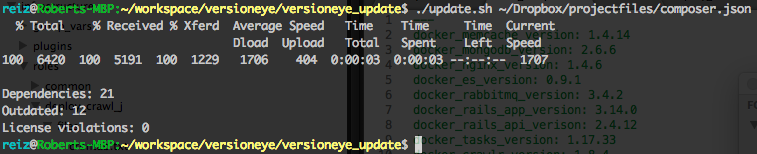

# VersionEye Update

[VersionEye](https://www.versioneye.com) can monitor your project on GitHub/Bitbucket and notify you about out-dated dependencies and [license violations](http://blog.versioneye.com/2014/09/15/license-whitelist/). The integration via the GitHub/Bitbucket API works very well and is very convenient. 

However. Not everybody is using GitHub/Bitbucket. Through the [VersionEye API](https://www.versioneye.com/api/) you can create/update projects as well and take advantage of the VersionEye infrastructure. Assume you created already a project through file upload or via the URL feature. Now you want to update the project every day automatically with your current project file to get the notifications. That's the mission of this project. 

## Requirements 

- [CURL](http://curl.haxx.se/), an open source command line tool and library for transferring data with URL syntax.
- [jq](http://stedolan.github.io/jq/), a lightweight and flexible command-line JSON processor. Available for Linux, Mac OS X and Windows. Please make sure that [jq](http://stedolan.github.io/jq/) is installed before you run the `update.sh` script. 

## Configuration 

Open the `update.sh` script and replace `<YOUR_SECRET_API_KEY>` in line 4 with your actual API KEY. You can get it from [here](https://www.versioneye.com/settings/api). Replace `<YOUR_PROJECT_ID>` in line 5 with the project ID from your VersionEye project. If you are using VersionEye Enterprise please adjust the `VERSIONEYE_SERVER` path in line 3 as well. 

```
#!/bin/bash 

VERSIONEYE_SERVER=https://www.versioneye.com
API_KEY=<YOUR_SECRET_API_KEY> 
PROJECT_ID=<YOUR_PROJECT_ID>
```

## Usage

The `update.sh` script is a very simple shell script which is updating an existing project at VersionEye with a current project file via CURL. Simply run this command

```
./update.sh <PROJECT_FILE>
```

to update an existing project at VersionEye with a project file. For example: 

```
./update.sh composer.lock
```

VersionEye will parse the uploaded project file and return a JSON object. The script will output the number of dependencies, the number of out-dated dependencies and the number of license violations if you have a [license whitelist](http://blog.versioneye.com/2014/09/15/license-whitelist/) assigned to your project at VersionEye. The result looks like that: 



## Supported project files 

Currently VersionEye supports 11 package managers. You can throw any of this project files against the [VersionEye API](https://www.versioneye.com/api/). 

 - Gemfile 
 - Gemfile.lock 
 - Podfile 
 - Podfile.lock 
 - package.json 
 - composer.json 
 - composer.lock
 - bower.json 
 - requirements.txt 
 - setup.py 
 - biicode.conf 
 - pom.xml 
 - project.clj 
 - *.gradle 
 - *.sbt 
 
For Maven multi module projects (reactor builds) please use the [VersionEye Maven Plugin](https://github.com/versioneye/versioneye_maven_plugin). 

## Continuous Integration Server

This script is ment to be executed on your Continuous Integration Server on each build. Ideally you update your VersionEye project with the current project file on each build. The `update.sh` script exits with status code 0 if there are 0 violations of the license whitelist. Otherwise it exits with status code 2. 
 
## Feedback 

For feedback please open a ticket here on GitHub or contact us on [Twitter](https://twitter.com/versioneye). 
